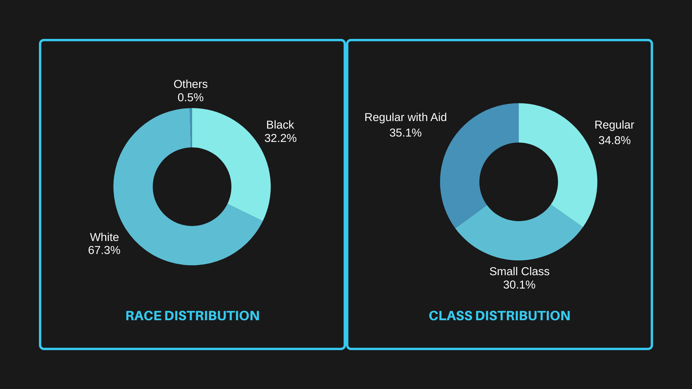
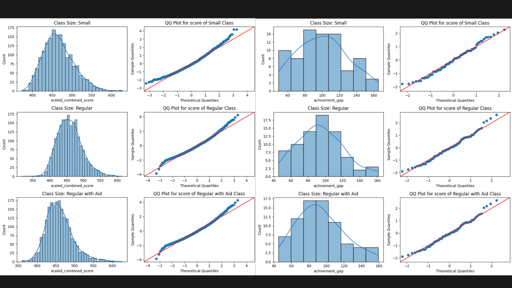

# Star Dataset Analysis

This repository contains an exploratory data analysis (EDA) and modeling project focused on the "Star" dataset. The project involves cleaning, analyzing, and visualizing the dataset to uncover insights and patterns.

## Project Overview

This project focuses on analyzing the effects of **class size** on student performance, exploring demographic factors, and assessing the resource allocation required to implement small class sizes in educational settings. Using statistical techniques and data visualization, the analysis aims to uncover significant patterns and interactions between various factors that influence learning outcomes.

### Key Areas of Focus:

- **Effect of Class Size on Learning**: 
  The analysis examines whether smaller class sizes positively impact student performance in math and reading. The dataset includes students from regular classes, regular classes with aid, and small classes.

- **Demographic Factors**: 
  The dataset also explores how different demographic factors such as **race**, **gender**, and **financial background** (represented by availing the free lunch scheme) affect student performance. 

- **Teacher Experience**: 
  The analysis includes data on teacher experience, ranging from 1 to 27 years, to determine if there is a correlation between teacher experience and student performance.

- **Statistical Hypothesis Testing**: 
  Various hypothesis tests were conducted to determine whether differences in academic performance are statistically significant across different class sizes, races, and demographic subgroups.

- **Two-Way ANOVA**: 
  Further statistical testing using a two-way ANOVA explored interactions between class size and demographic factors like race, gender, and financial background.

## How to Use
1. Clone the repository:
   ```bash
   git clone https://github.com/KAUSTUBH140303/Star_EDA_Modelling.git
2. Install all the required dependencies:
   ```bash
   cd Star_EDA_Modelling
   pip install -r requirements.txt
## Key Figures



## Results

The analysis of the "Star" dataset provided several key insights regarding the effects of class size, demographic factors, and resource allocation on student performance:

- **Effect of Class Size**: 
  Students in smaller classes consistently outperformed those in regular and regular-with-aid classes. Both math and reading scores showed significant improvements in smaller class sizes, confirming that smaller class sizes positively affect academic performance.

- **Demographic Influence**:
  - **Race**: There was a significant difference in performance between students from white-dominated and black-dominated schools, with white-dominated schools generally showing higher performance.
  - **Gender**: Girls performed better in regular and regular-with-aid classes compared to boys, but both genders performed similarly in small classes.
  - **Financial Background**: The free lunch scheme, which represented students from lower financial backgrounds, showed no significant interaction with class size in terms of academic performance.

- **Teacher Experience**: 
  Teacher experience ranged from 1 to 27 years in the dataset, but no clear pattern emerged linking teacher experience directly to student performance.

- **Statistical Analysis**:
  - **Hypothesis Testing**: Multiple hypothesis tests confirmed that class size significantly influences student academic performance, with smaller class sizes providing a measurable benefit. However, the achievement gap between the top and bottom performers within each class type showed no significant differences.
  - **Two-Way ANOVA**: While no significant interactions were found between class size and demographic factors such as race or financial background, a statistically significant interaction between class size and gender was observed.

These results provide strong evidence that smaller class sizes are beneficial to academic performance, with certain demographic factors like gender also playing a role in influencing outcomes under different class settings.

## Possible Expansion in the Indian Setting

While the analysis in this project focuses on class sizes and their effect on learning in the provided dataset, similar studies and data from India offer insights into the potential implications of class size adjustments in the Indian context.

According to research by the [RISE Programme](https://riseprogramme.org/sites/default/files/2021-01/RISE_WP-0059_Datta_Kingdon.pdf):

- **Class Size and Performance**: In Indian schools, student performance in science subjects tends to decline significantly when class sizes exceed 41 students. This threshold is higher for non-science subjects, with performance deteriorating when class sizes exceed 51 students.
  
- **Economic Considerations**: During the 2017-18 period, India incurred costs of approximately **USD 3.6 billion** to reduce the pupil-to-teacher ratio (PTR). However, research suggests that reducing class sizes to 30 or below in secondary education may not lead to better learning outcomes and could instead drive up costs.

- **Policy Proposals**: In light of these findings, proposals have been made to **increase the PTR to 40** pupils per teacher in both elementary and secondary schools. This change is estimated to save India **USD 19.4 billion annually** in teacher salary expenses, without compromising learning outcomes.

This suggests that, while reducing class sizes can positively impact learning in certain contexts, the economic and logistical factors in countries like India necessitate careful balancing of class sizes, resource allocation, and learning outcomes.
